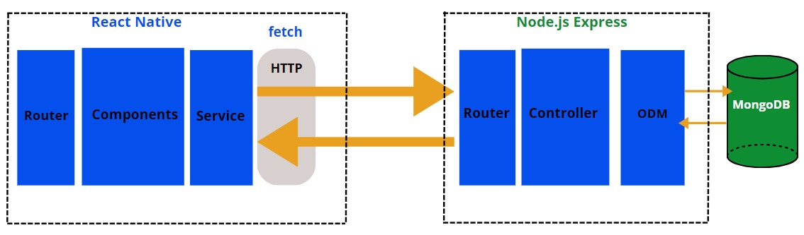

# SecurCity App


This article introduces our user-friendly app for tracking danger zones in the user's area, aiming to offer better security for users, their families, and friends. Our focus is on making tracking, locating, and alerting about danger much easier. An important part of our platform is the integration of a notification system that allows the user to make an emergency alert. This advanced tool helps minimize danger and provides users with a more secure environment. By using technology to help tracking, our goal is not just to make the city safer but also to help keep track of danger areas.

## Table of Contents

- [Overview](#overview)
- [Software Architecture](#software-architecture)
- [Frontend](#frontend)
- [Backend](#backend)
- [Getting Started](#getting-started)
- [Video Demonstration](#Video-Demonstration)
- [Contributing](#contributing)

## Overview

The project aims to create a user-friendly app for tracking danger zones in the user's area, offering better security for users, their families, and friends. Our focus is on making tracking, locating, and alerting about danger much easier. An important part of our platform is the integration of a notification system that allows the user to make an emergency alert. This advanced tool helps minimize danger and provides users with a more secure environment. By using technology to help tracking, our goal is not just to make the city safer but also to help keep track of danger areas.

## Software Architecture



The software architecture follows a decoupled approach, employing a MERN stack for the development. The backend infrastructure is built with Express.js, while the frontend is developed using React Native with Expo.

### Frontend

#### Technologies Used

- React Native
- Expo
- React
- CSS

#### Project Structure

The React Native cross-platform app project is organized around several components, each serving a specific purpose and contributing to the overall architecture and maintainability of the application.

##### 1. AUTHENTICATION Component

- **Purpose:** Handles the registration and login of the users.
- **Functionality:** Users can input their name, email address, and password to access the app.

##### 2. LOCATION Component

- **Purpose:** Focuses on displaying, adding, and retrieving danger zones from the backend server.
- **Functionality:** Fetches and presents danger zones, enabling users to view the zones they should avoid.

##### 3. DASHBOARD Component

- **Purpose:** Serves as the central hub for users, offering an overview of statistics and important information.
- **Functionality:** Aggregates data from various sources and presents it in a visually appealing and informative manner.

##### 4. PROFILE Component

- **Purpose:** Handles the display of user information.
- **Functionality:** Allows users to access and manage their personal information.

##### Routing

- **React Native Navigation Router:** Utilized to navigate between different components, ensuring a seamless user experience.

##### Styling and Theming

- **Styling:** Plain CSS is used for styling.

### Backend

#### Technologies Used

- Express.js
- MongoDB

#### Project Structure

The backend code follows a modular and organized structure, leveraging the power of Express.js for building a robust, simple, and scalable application.

##### 1. `/backend/app.js`

- **Main Application Component:** Serves as the entry point for the application. It includes the `main` method to start the application.

##### 2. `/backend/routes`

- **Routes:** Contains classes responsible for handling incoming HTTP requests. Each route class is dedicated to a specific feature or entity, exposing RESTful endpoints.

##### 3. `/backend/controllers`

- **Controllers:** Encapsulate business logic. These classes are used by routes to perform operations on data and communicate with services. They provide a layer of abstraction between routes and services.

##### 4. `/backend/models`

- **Models:** Represent data entities in the application. These classes define the structure of the database collections.

##### 5. `/backend/repos`

- **Repositories:** Interfaces that provide methods for basic CRUD operations and are used by services to interact with the database.

### Dependencies

1. **Mongoose:**
   - Purpose: Simplifies data access using MongoDB.

## Getting Started

Here are step-by-step instructions to set up and run your project locally:

### Prerequisites

1. **Git:**
   - Ensure Git is installed. Download and install it from [git-scm.com](https://git-scm.com/).

2. **Node.js and NPM:**
   - Install Node.js from [nodejs.org](https://nodejs.org/). NPM is included with Node.js.

3. **Expo CLI:**
   - Install Expo CLI globally:
     ```bash
     npm install -g expo-cli
     ```

### Backend Setup

1. **Clone the Project:**
   ```bash
   git clone <repository_url>
   cd <project_folder>
   ```

2. **Install Backend Dependencies:**
   ```bash
   cd backend
   npm install
   ```

3. **Run Backend:**
   ```bash
   npm start
   ```

### Frontend Setup

1. **Navigate to Frontend Folder:**
   ```bash
   cd frontend
   ```

2. **Install Frontend Dependencies:**
   ```bash
   npm install
   ```

   - If you encounter errors during installation, use the following command:
     ```bash
     npm install --save --legacy-peer-deps
     ```

3. **Run Frontend:**
   ```bash
   expo start
   ```

Now, your full-stack project should be up and running locally. If you encounter any issues during setup, check the console logs for error messages and ensure that all dependencies and prerequisites are correctly installed.

## Illustrative Example

We aim to present a scheduling solution based on a student’s learning preferences and constraints. This particular student possesses specific learning space requirements, necessitates access to specific infrastructure and equipment, and expresses a preference for a hybrid learning mode.


Figure 2: Interface (Admin) for different managements

Consequently, the generated program will account for these constraints and preferences, offering a diverse and suitable plan for their academic journey.


Figure 3: A proposed scheduling program learning for a student

# Video Demonstration

https://github.com/Hanaa07/SafeZone-Project/assets/SecurCity_demo.mp4


## Contributing

We welcome contributions from everyone, and we appreciate your help to make this project even better! If you would like to contribute, please follow these guidelines:

## Contributors

- ABOU KHAIR Ouassima ([GitHub](https://github.com/OuassimaAboukhair))
- EL YANBOUAI Hanaâ ([GitHub](https://github.com/Hanaa07))
- ELBARRAQ Yousra ([GitHub](https://github.com/yousraeb))
- HADEQ Hamza ([GitHub](https://github.com/ST3ERLING))
- OUKHOUYY Chaymae ([GitHub](https://github.com/chaymaeoukhouyy))
- Mohamed Lachgar ([Researchgate](https://www.researchgate.net/profile/Mohamed-Lachgar))
